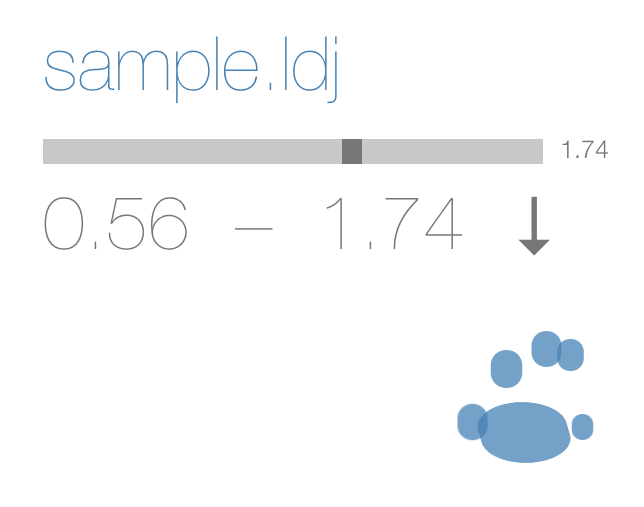

# leap-view

Render [leap motion](https://www.leapmotion.com) gesture samples recorded with the [leap-record](https://github.com/joyrexus/leap-record) utility.

The inline viewer ([index.html](index.html)) provides ...

* simple playback controls

* user-specifiable time ranges

* extraction of motion data within specified time ranges

---

---

See [data](tree/master/data) for a sample data file.

See [docs/overview](https://github.com/joyrexus/leap-view/blob/master/docs/overview.md) for a step-by-step walkthrough of the process of capturing and
extracting gesture data.
