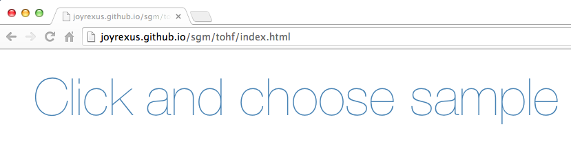
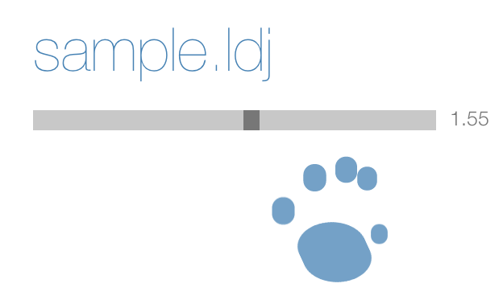
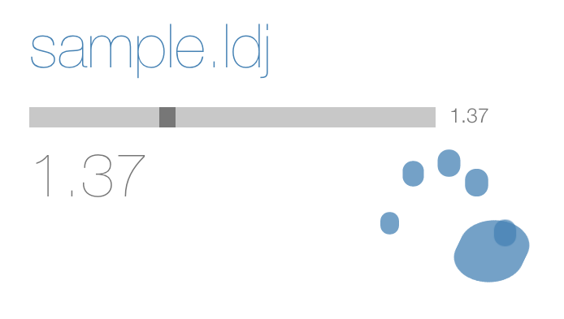
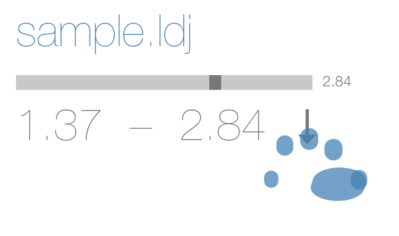
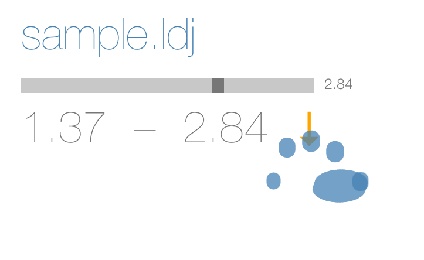
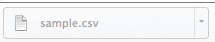
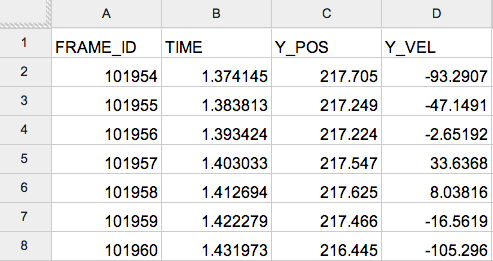

# Leap Motion Gesture Samples

A quick walkthrough demonstrating the process of ...

1. recording a gesture sample with the Leap motion device
2. viewing recorded samples
3. extracting postion and velocity data from recorded samples

## Recording a gesture sample

Use the [leap-record](https://github.com/joyrexus/leap-record#leap-record) command-line utility to record a gesture sample.  After installing, you'd use it as follows:

    leap-record MY-SAMPLE.ldj

If you don't specify a filename it saves the file as `sample.ldj`.

You'll get get prompted to start and stop the recording.

The resulting sample file contains leap frame data saved as [line-delimited JSON](http://en.wikipedia.org/wiki/Line_Delimited_JSON).  This is a convenient format for the reading and writing of data streams.  For example, such a format makes it easy to extract specific attributes from each line/frame.  The [ldj-pipe] (https://github.com/joyrexus/ldj-pipe#ldj-pipe) is designed to make this sort of streaming data extraction easy and straightforward.

## Rendering recorded samples

Once you have a sample recorded, you can load and view it in a web browser using our [viewer](https://github.com/joyrexus/leap-view).  The viewer allows you to click and choose a sample file you've recorded (e.g. [sample.ldj](https://github.com/joyrexus/leap-view/blob/master/data/sample.ldj)).  

Below we'll walk through an example of loading a recorded sample, using the playback controls, and selecting a region of interest (a subset of frames representing a duration of time within the full sample). Once a region/duration is selected you can download the position/velocity data associated with that region. (Note: Given our particular research question, we're only interested in the **vertical** position and velocity of the captured gesture.)

---

After navigating to the [viewer](http://joyrexus.github.io/sgm/tohf/index.html) you'll see the following: 

---

Once you've loaded your sample file in the viewer it will render the recorded hand motions.  You'll see the recorded hand gestures represented as a palm and a set of fingertips.

---

You can always load a new sample by clicking the filename of the currently loaded sample.

#### Playback controls

The viewer provides basic playback controls as well as the ability to specify particular regions of interest within the sample.  

The primary playback control is the spacebar, which toggles between a pause and
play state.  You can also use the arrow keys to navigate through the rendered frames when playback is paused:

* `spacebar` - pause/play
* `up arrow` - go back 1 frame
* `down arrow` - go forward 1 frame
* `left arrow` - jump back 10 frames
* `right arrow` - jump forward 10 frames

Additionally, you can use the range-slider to manually slide forward or
backward in time within the sample.  

## Extracting position/velocity data

The range-slider and keyboard controls make it possible to identify specific regions of interest (i.e., durations of time) within the sample.  Once a region/duration is specified you can download a CSV file containing the postion/velocity data for that particular region for analysis.

Using the playback controls, find the starting point of the region you want to analyze.  The viewer should be paused on whatever frame you want as the starting point.  Click the palm of the rendered hand to mark the starting time:

---

Similarly, identify the final frame of the region of interest and click the
palm of the rendered hand to mark the stopping time:

In this example, we've now selected a duration of time extending from 1.37 to
2.84 seconds.

---

Note how the hand rendering utilizes the full screen width and height to
make fine-grained gestural movement easier to perceive.  As a result, the hand
rendering may partly overlap the playback controls, but in practice we haven't
found this to be a problem.  (If we find it is a problem, we can constrain the
hand rendering to a smaller viewing space.)

In addition to starting and stopping times, a downward arrow button will
appear.  Click this button to download the CSV file containing the
position/velocity data for the selected region:

---

Your browser should indicate (typically in the lower left-hand corner) that the CSV data file was downloaded:

---

The CSV file should be downloaded automatically to your `Downloads` folder.
[The resulting file](https://docs.google.com/spreadsheet/ccc?key=0AmrUeNvUdKG1dFlJbUdVRmVCbTNjcVFPUTFRdi1Kb3c&usp=sharing) will have a file name corresponding to the sample file that was loaded.  For example, if you loaded a file named `sample.ldj`, the resulting file will be named `sample.csv`. 

This file will have one row per frame within the specified duration, with
attributes for each frame in the following four columns:

* `FRAME_ID` - the unique frame ID
* `TIME` - timestamp in seconds
* `Y_POS` - vertical position
* `Y_VEL` - vertical velocity

The screenshot below shows a [sample data file](https://docs.google.com/spreadsheet/ccc?key=0AmrUeNvUdKG1dFlJbUdVRmVCbTNjcVFPUTFRdi1Kb3c&usp=sharing). 

## Customizing the motion data to be extracted

The demo viewer was designed to extract and download vertical position/velocity
data for user-selected ranges.  You can customize the motion data that gets extacted and downloaded by modifying the [exportRange](https://github.com/joyrexus/leap-view/blob/master/src/main.coffee#L75-L86) method in [main.js](https://github.com/joyrexus/leap-view/blob/master/lib/main.js#L103-L116).

What motion data is available for extraction?  See [this reference](https://github.com/leapmotion/leapjs/blob/master/PROTOCOL.md#frames) for an overview of the JSON schema used for each of the frames within a sample. See the provided gesture sample ([sample.ldj](https://github.com/joyrexus/leap-view/blob/master/data/sample.ldj)) to see some sample frames, where each line consists of one frame.
